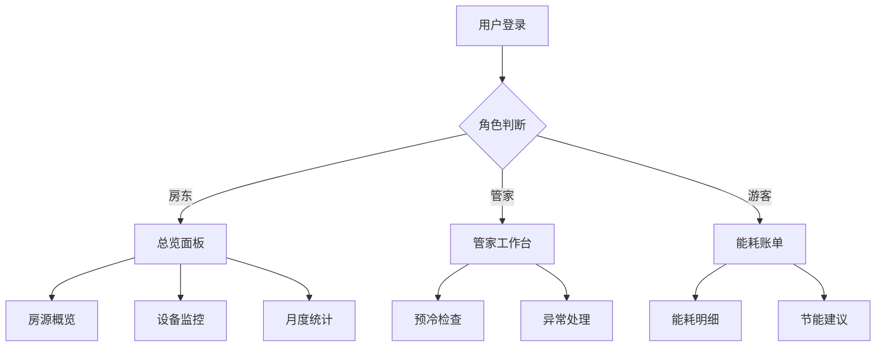

## 1. 产品概述

海岛民宿能耗托管系统是一套面向海岛民宿运营的能源管理平台，通过接入空调、热水器、光伏和蓄水设备，实现能耗实时监控、异常预警和智能节能建议。

- 目标用户：房东、管家、住客
- 核心价值：降低运营能耗成本、提升入住体验、精细化能源管理

## 2. 核心功能

### 2.1 用户角色

| 角色 | 登录方式 | 核心权限 |
|------|----------|----------|
| 房东 | 账号登录 | 全局房源概览、所有设备监控、月度统计对比、账单管理 |
| 管家 | 账号登录 | 入住前预冷检查、设备异常处理、当日能耗监控 |
| 游客 | 订单号查询 | 查看入住期间能耗账单、获取节能建议 |

### 2.2 功能模块

1. **房东总览面板**：房源概览卡片、设备状态总览、关键能耗指标
2. **设备监控详情**：空调、热水器、光伏、蓄水实时状态与历史数据
3. **管家工作台**：今日入住列表、预冷状态检查、异常耗电预警
4. **住客账单页**：能耗明细账单、费用统计、个性化节能建议
5. **月度统计页**：多房源用水用电对比、趋势图表、节能排行

### 2.3 页面详情

| 页面名称 | 模块名称 | 功能描述 |
|----------|----------|----------|
| 房东总览 | 房源概览卡片 | 展示各房源基本信息、在线状态、今日能耗 |
| 房东总览 | 设备状态总览 | 空调/热水器/光伏/蓄水四类设备数量与状态分布 |
| 房东总览 | 关键指标卡片 | 今日总用电、总用水、光伏发电量、节能百分比 |
| 设备详情 | 设备列表 | 按类型筛选设备，显示运行状态、实时功率/温度 |
| 设备详情 | 历史趋势图 | 24小时能耗曲线图，支持设备对比 |
| 管家工作台 | 今日入住列表 | 显示今日入住房间、预冷状态、可一键启动预冷 |
| 管家工作台 | 异常预警列表 | 耗电异常设备、故障设备、待处理事项 |
| 住客账单 | 能耗明细 | 入住期间每日用电用水明细、峰谷电价 |
| 住客账单 | 费用统计 | 总费用、分项费用、与平均水平对比 |
| 住客账单 | 节能建议 | 个性化节能小贴士、预计可节省费用 |
| 月度统计 | 房源对比 | 柱状图对比各房源月度水电用量 |
| 月度统计 | 趋势分析 | 月度能耗趋势折线图、同比环比数据 |
| 月度统计 | 节能排行 | 房源节能排行榜、最佳实践案例 |

## 3. 核心流程

### 3.1 管家预冷检查流程
管家登录系统 → 查看今日入住列表 → 检查房间预冷状态 → 对未预冷房间一键启动预冷 → 确认预冷进度

### 3.2 住客查看账单流程
住客离店后 → 输入订单号/扫码 → 查看入住期间能耗明细 → 获取节能建议 → 查看费用统计

### 3.3 房东月度复盘流程
房东登录 → 进入月度统计 → 查看各房源能耗对比 → 分析趋势变化 → 查看节能排行

## 4. 用户界面设计

### 4.1 设计风格

- **设计主题**：海岛清风 · 自然简约
- **主色调**：海洋蓝 `#0EA5E9`、珊瑚橙 `#F97316`、薄荷绿 `#10B981`
- **辅助色**：深海蓝 `#0369A1`、沙滩米 `#FEF3C7`、浅海蓝 `#E0F2FE`
- **字体**：标题使用 'DM Sans'，正文使用 'Inter'
- **布局风格**：卡片式布局、大圆角（16px）、柔和阴影
- **图标风格**：线性图标，使用 lucide-react
- **整体氛围**：清新、通透、有海洋气息，仿佛置身海岛

### 4.2 页面设计概述

| 页面名称 | 模块名称 | UI 元素 |
|----------|----------|---------|
| 房东总览 | 顶部导航 | 渐变背景、logo、角色切换、用户头像 |
| 房东总览 | 指标卡片组 | 四个彩色渐变卡片，带图标和数值，悬停微动效 |
| 房东总览 | 房源列表 | 卡片网格布局，展示房源图片、名称、设备状态徽章 |
| 设备详情 | 设备分类标签 | 横向滚动标签栏，选中态有下划线动画 |
| 设备详情 | 设备卡片 | 设备图标、名称、状态指示灯、实时数据、趋势小图 |
| 管家工作台 | 入住时间线 | 垂直时间线，展示今日入住/离店安排 |
| 管家工作台 | 预冷状态 | 进度条 + 温度显示，绿色表示已达标 |
| 住客账单 | 账单头部 | 房源信息、入住日期、总费用大数字 |
| 住客账单 | 能耗环形图 | 用电用水占比环形图，带动画效果 |
| 月度统计 | 对比柱状图 | 多房源对比，悬停显示详情 |
| 月度统计 | 趋势折线图 | 平滑曲线，渐变填充 |

### 4.3 响应式设计

- 桌面端（≥1280px）：多列网格布局，侧边栏导航
- 平板端（768px-1279px）：两列布局，顶部导航
- 移动端（<768px）：单列堆叠，底部 Tab 导航

### 4.4 动效设计

- 页面切换：淡入淡出 + 轻微上移动画
- 卡片悬停：阴影加深 + 轻微上浮（translateY(-2px)）
- 数据更新：数值变化时数字滚动动画
- 图表加载：从左到右渐进式绘制
- 状态变化：颜色渐变过渡
