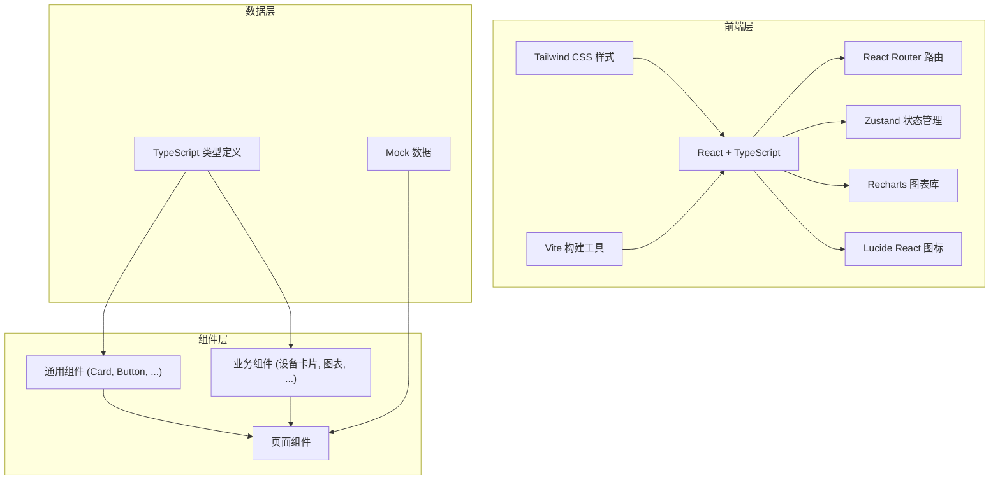
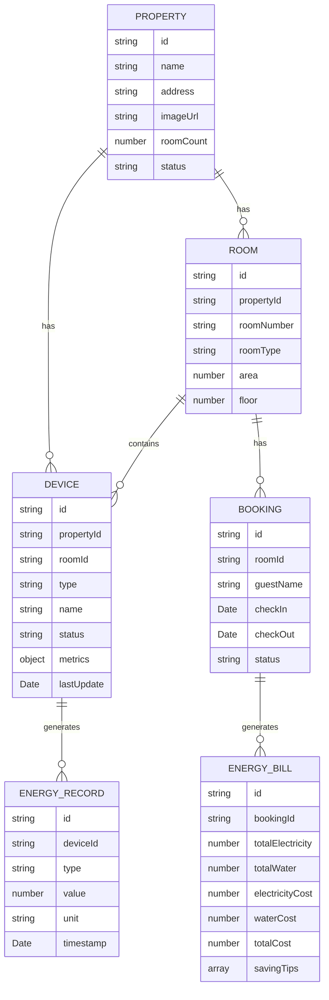

## 1. 架构设计



## 2. 技术描述

- **前端框架**：React 18 + TypeScript
- **构建工具**：Vite 5
- **样式方案**：Tailwind CSS 3
- **路由管理**：React Router DOM 6
- **状态管理**：Zustand 4
- **图表库**：Recharts 2
- **图标库**：Lucide React
- **数据方案**：前端 Mock 数据（无后端）
- **初始化模板**：react-ts（纯前端）

## 3. 路由定义

| 路由路径 | 页面用途 |
|----------|----------|
| `/` | 首页/登录选择页（角色选择） |
| `/landlord` | 房东总览面板 |
| `/landlord/devices` | 设备监控详情页 |
| `/landlord/statistics` | 月度统计分析页 |
| `/steward` | 管家工作台首页 |
| `/steward/precooling` | 预冷检查详情页 |
| `/steward/alerts` | 异常预警列表页 |
| `/guest` | 游客账单查询页 |
| `/guest/bill` | 能耗账单详情页 |

## 4. 数据模型

### 4.1 数据模型定义



### 4.2 设备类型说明

| 设备类型 | 指标 | 单位 |
|----------|------|------|
| 空调 (ac) | 功率、设定温度、室内温度、运行模式 | W, °C |
| 热水器 (water_heater) | 功率、水温、水位 | W, °C, % |
| 光伏 (pv) | 发电功率、日发电量、累计发电量 | W, kWh |
| 蓄水 (water_tank) | 水位、用水量、进水流量 | %, L, L/min |

## 5. 项目目录结构

```
src/
├── components/          # 通用组件
│   ├── ui/             # 基础UI组件 (Card, Button, Badge...)
│   ├── charts/         # 图表组件
│   └── layout/         # 布局组件 (Header, Sidebar...)
├── pages/              # 页面组件
│   ├── home/           # 首页/角色选择
│   ├── landlord/       # 房东端页面
│   ├── steward/        # 管家端页面
│   └── guest/          # 游客端页面
├── store/              # Zustand 状态管理
├── data/               # Mock 数据
├── types/              # TypeScript 类型定义
├── utils/              # 工具函数
├── hooks/              # 自定义 Hooks
├── App.tsx
├── main.tsx
└── index.css
```
